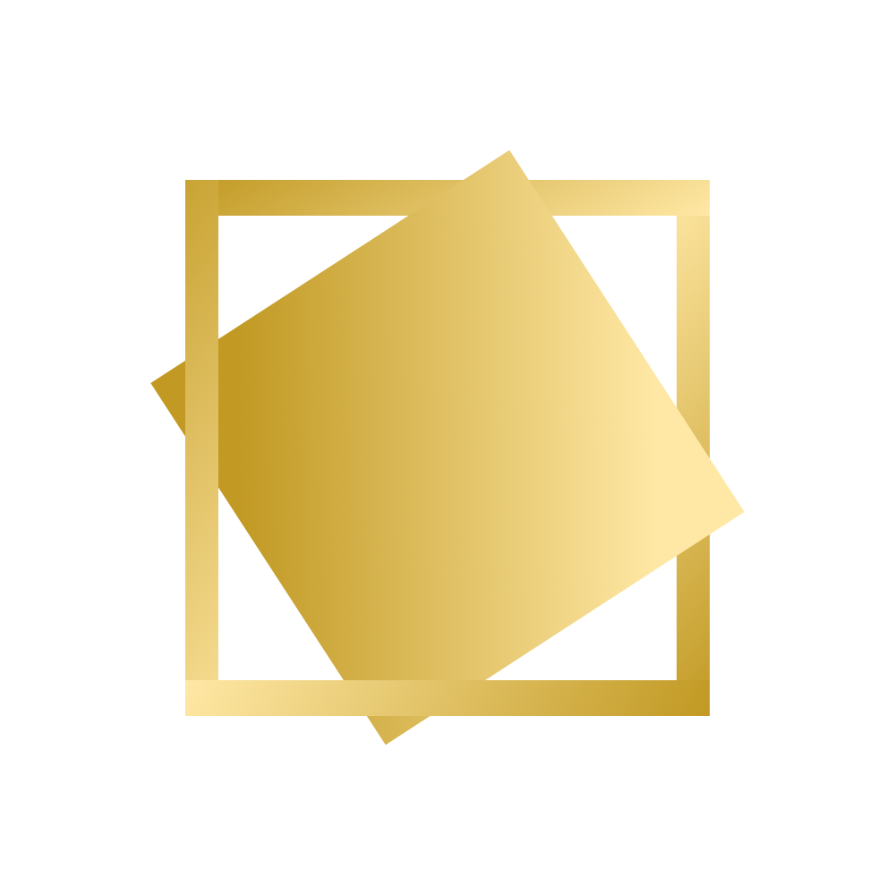
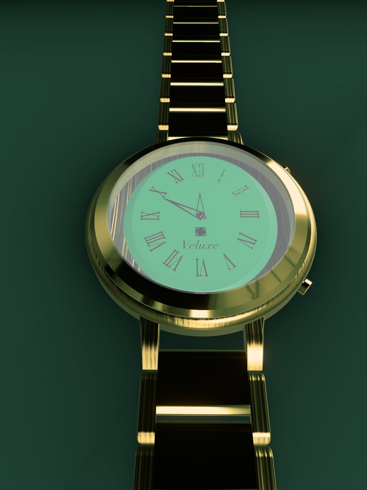
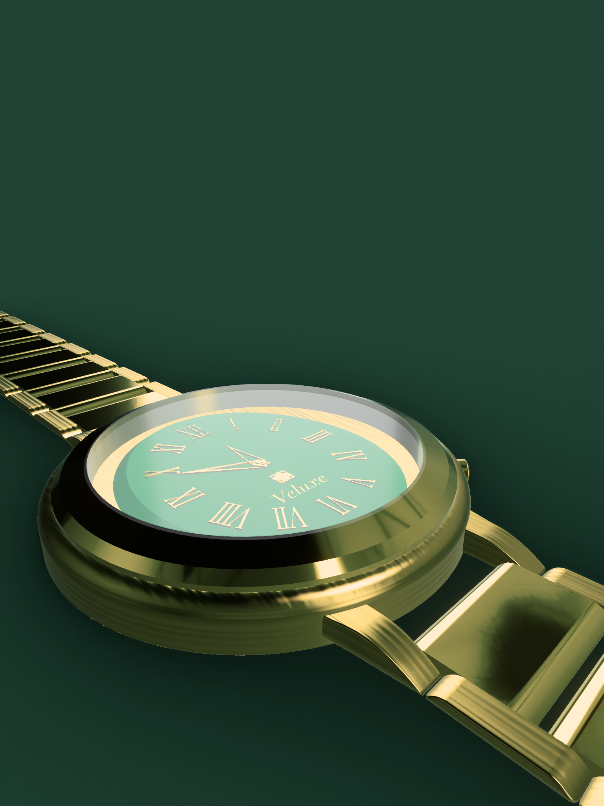
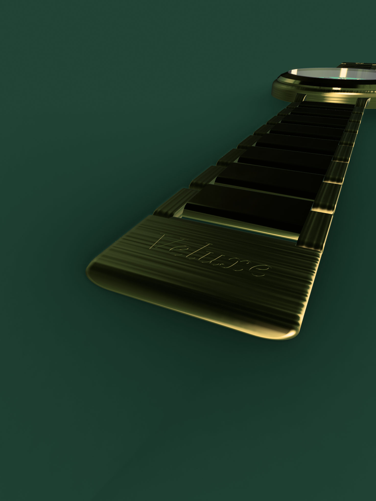
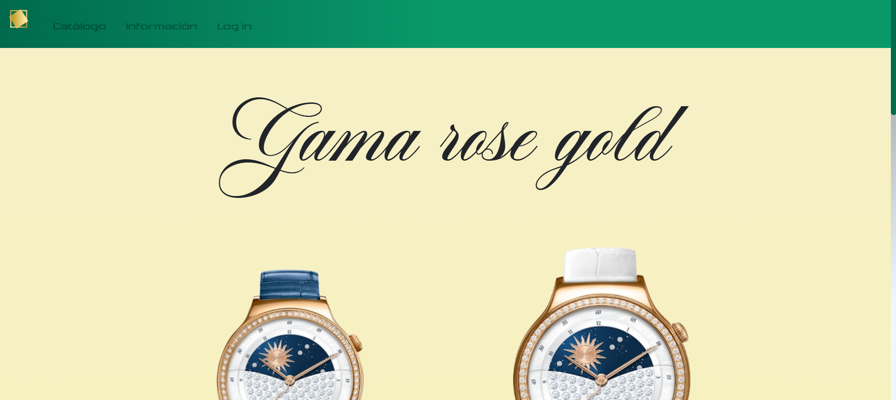
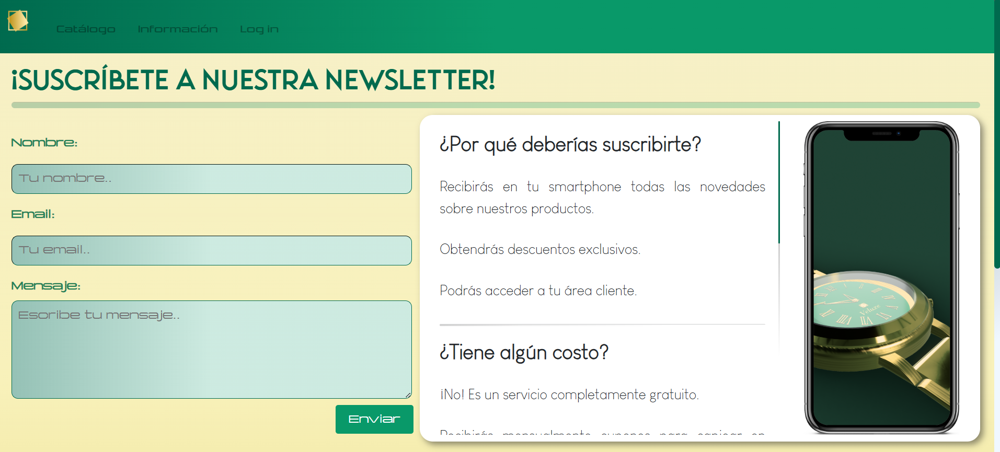

# Resumen
Desarrollo frontend de un e-commerce de relojería de alta gama, creado como proyecto final de ciclo en equipo. El foco principal reside en la experiencia de usuario (UX/UI), logrando una estética lujosa y minimalista mediante una maquetación cuidada y el uso de animaciones fluidas que transmiten exclusividad.

# Veluxe
Una experiencia de e-commerce inmersiva donde desarrollo web y diseño 3D se unen.

Puedes visitar la web en funcionamiento aquí: **[🔗 Ver Proyecto Online](https://daicaluc.github.io/Veluxe/)**

---

## Sobre el Proyecto
Este proyecto fue desarrollado como **Trabajo de Final de Grado** para el ciclo de SMR. El objetivo era superar las expectativas de una tienda estándar, creando una identidad de marca de lujo real.

Para lograr la máxima exclusividad, **El reloj protagonista fue modelado en 3D específicamente para este proyecto**, permitiéndonos controlar totalmente la iluminación, los ángulos y la estética visual del producto.

### Características Principales
* **Activos 3D Originales:** Diseño y renderizado propio del producto.
* **Diseño Premium (UI):** Paleta de colores y tipografías que respiran lujo.
* **Micro-interacciones:** Animaciones sutiles que enriquecen la navegación.
* **Diseño Responsivo:** Adaptación fluida a cualquier dispositivo.

---

## Diseño y Modelado 3D
Un punto clave de este proyecto fue la creación del reloj desde cero. Se modeló, texturizó y renderizó el producto para asegurar que encajara perfectamente con la paleta de colores de la web.

| Render Frontal | Detalle Esfera | Detalle logo |
| :---: | :---: | :---: |
|  |  |  |

*(Puedes ver más renders en alta calidad en la carpeta `/Modelo3D` de este repositorio)*

---

## 🛠️ Stack Tecnológico

* **Web Core:** HTML5, CSS3 / SASS, JavaScript (ES6+).
* **Diseño 3D:** [Sharp3D].
* **Control de Versiones:** Git & GitHub.

---

## 📸 Galería de la Web

| Producto | Contacto |
| :---: | :---: |
|  |  |

---

## Equipo y Colaboración

* **[Daniel Casado]**: [Diseñador]. Responsable del **Diseño y Modelado 3D del producto**, así como del desarrollo Frontend (HTML/CSS/JS) y las animaciones.
* **[Kevin Gravdal]**: [Estructuración]. Encargado de la estructura de datos, textos y gestión del repositorio.

---

## Contacto
Si te interesa mi perfil híbrido entre desarrollo y diseño 3D, hablemos:

* [LinkedIn](linkedin.com/in/danicasadomanza)
* [Email](mailto:danicasadomanza@gmail.com)
